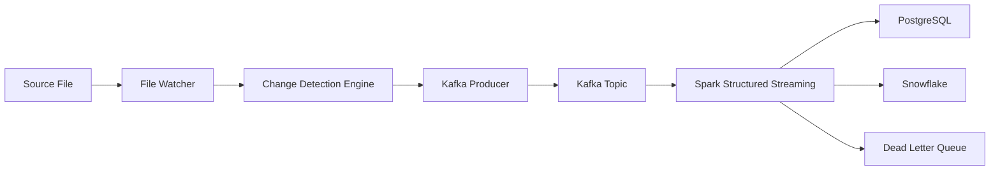
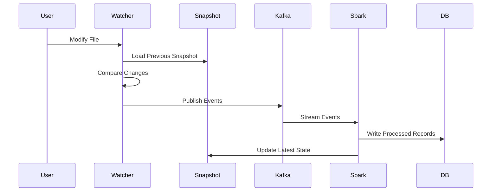
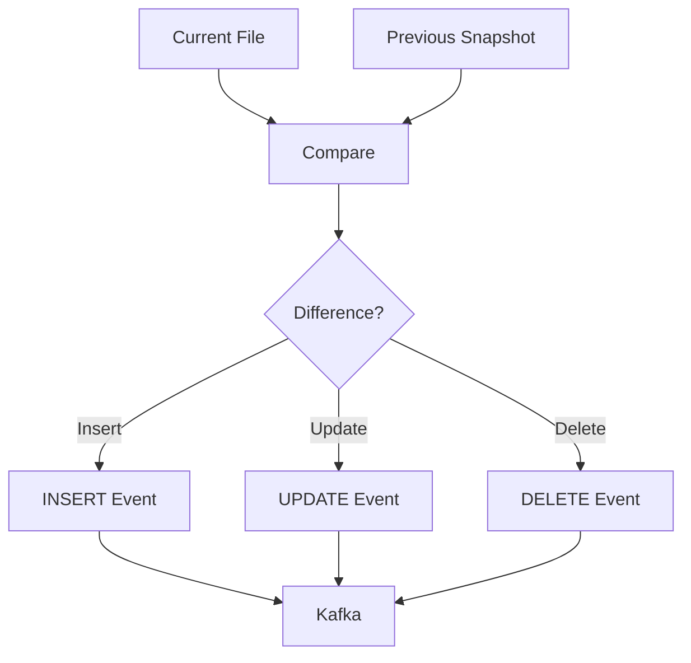

# Real-Time Change Data Streaming Pipeline
**Author:** Jaya Kotagiri

---

# Project Overview

This project is my implementation of a real-time file change tracking and streaming platform using Python, Apache Kafka, Spark Structured Streaming, PostgreSQL, and Snowflake.

Instead of reprocessing an entire file whenever it changes, the system detects line-level INSERT, UPDATE, and DELETE operations and streams only the meaningful changes through Kafka.

The goal was to understand how modern event-driven data engineering systems are built and how Change Data Capture (CDC) concepts can be implemented for flat files.

---

# Why I Built This

In many organizations, source files are updated frequently.

Reloading the entire file after every change is inefficient and expensive at scale.

I wanted to build a system that:

- Detects only what changed
- Streams those changes in real time
- Stores them reliably
- Supports fault tolerance and recovery

This project helped me gain hands-on experience with Kafka, Spark Streaming, and production-oriented data engineering practices.

---

# High-Level Architecture



---

# Detailed Processing Flow



---

# Project Structure

```text
streaming_pipeline/
│
├── producer/
│   ├── file_watcher.py
│   ├── change_detector.py
│   └── kafka_producer.py
│
├── consumer/
│   ├── spark_consumer.py
│   └── transformations.py
│
├── config/
│   └── config.yaml
│
├── snapshots/
│
├── logs/
│
├── tests/
│
├── requirements.txt
│
└── README.md
```

---

# Design Decisions

## Snapshot-Based Comparison

Instead of comparing files against the original version, the pipeline compares each new version with the latest snapshot.

Benefits:

- Faster processing
- Lower memory consumption
- Accurate change tracking

## Event-Driven Processing

Each change becomes an independent event.

Benefits:

- Better scalability
- Easier downstream consumption
- Supports multiple consumers

## Dead Letter Queue

Invalid records are redirected to a DLQ instead of stopping the pipeline.

Benefits:

- Higher reliability
- Easier troubleshooting

## Checkpointing

Spark checkpoints maintain processing state and support recovery after failures.

---

# Change Detection Logic



---

# Challenges Faced

## Multiple Rapid File Saves

Problem:

Multiple save operations generated duplicate events.

Solution:

Implemented debounce logic to reduce unnecessary processing.

---

## Identifying Updates

Problem:

Initially, updates appeared as a delete followed by an insert.

Solution:

Used Python SequenceMatcher to improve update detection accuracy.

---

## Streaming Recovery

Problem:

Understanding Kafka offsets and Spark checkpoints.

Solution:

Implemented checkpoint locations and tested restart scenarios.

---

# Key Learnings

Through this project I learned:

- Kafka Producers and Consumers
- Spark Structured Streaming
- Event-Driven Architecture
- CDC Concepts
- Fault-Tolerant Design
- PostgreSQL Integration
- Snowflake Integration
- Production Pipeline Design

---

# Future Enhancements

- Docker Deployment
- Kubernetes Deployment
- GitHub Actions CI/CD
- Prometheus Monitoring
- Grafana Dashboards
- Schema Registry Integration
- Cloud Deployment on AWS

---

# Resume Summary

Built a real-time Change Data Streaming Pipeline using Python, Kafka, Spark Structured Streaming, PostgreSQL, and Snowflake. Implemented line-level CDC, event-driven processing, checkpointing, DLQ handling, and fault-tolerant data ingestion for scalable streaming analytics.

---

# Technology Stack

| Layer | Technology |
|---------|---------|
| Programming | Python |
| Messaging | Apache Kafka |
| Stream Processing | Spark Structured Streaming |
| Database | PostgreSQL |
| Data Warehouse | Snowflake |
| Configuration | YAML |
| Testing | Pytest |
| Version Control | Git & GitHub |

---

# Author Notes

This project was built as a learning-focused yet production-inspired implementation of real-time change data processing.

The objective was not only to learn individual technologies but also understand how they work together in a complete end-to-end data engineering solution.
